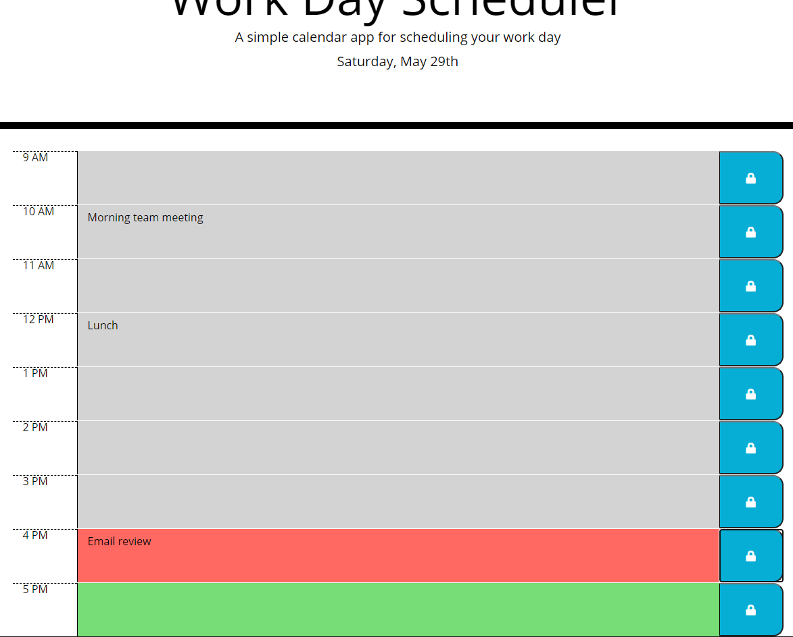

Homework Assignment - 05 Third-Party APIs: Work Day Scheduler

## Description
The focus of this homework assignment for the University of Toronto SCS Coding Boot Camp was to create a simple calendar application that allows the user to save events for each hour of the day. Starter code was provided including an HTML file with the day planner header without the current date displayed and a CSS style sheet. The app runs in the browser and features dynamically updated HTML and CSS powered by jQuery.

## Key Features
- Event listeners are used to ...
- Details of hourly scheduled events are saved to localStorage with the help of JSON and will populate the day planner when page is reloaded 
- jQuery to create rows
- DOM traveral - for saving event description, for coloring event description rows
- Bootstrap grid
- Moment.js

## Link
Website can be found here: https://darylnauman.github.io/day-planner/

## Screenshot
The following image shows a snapshot of a portion of the webpage:

